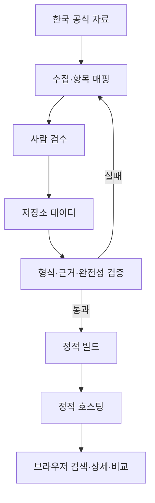

# phone — 휴대폰 판매 상담 도구 기획·설계서

작성일: 2026-09-28 · 버전: 1.0 · 대상 저장소: ayhappy99/phone

이 문서는 구현을 위한 기획·설계 결과다. 실제 서비스, 전체 기종 데이터 수집, 배포가 완료되었다는 의미가 아니다. 특정 제품의 최신성이나 전체 스펙 검증 완료를 주장하지 않는다.

## 1. 목표와 확정 범위

전문 판매자가 고객이 묻는 휴대폰을 빠르게 찾고, 정확한 스펙·용량별 출고가·전작과의 차이를 근거 있는 상담 문장으로 설명하도록 돕는다. 사용자를 초보자로 취급하지 않으며 정확한 기술 용어와 쉬운 설명을 함께 제공한다.

사용자 확인으로 확정한 조건:

- 한국 공식 판매 모델, 삼성·애플, 한국어 UI, 원화 가격을 대상으로 한다.
- 별도 백엔드를 운영하지 않는 정적 웹사이트로 제공한다. 정적 호스팅 URL 접속은 허용한다.
- 기종 검색, 모델 상세, 용량별 출고가, 두 모델 비교, 전작 대비 변화, 상담 멘트, 공식 전체 스펙, 출처 확인을 필수로 한다.
- 확인되지 않은 제품 정보는 서비스에 사실로 노출하지 않는다.

설계 선택: 로그인·서버 DB·실시간 생성형 AI 없이 검증된 정적 데이터로 동작한다. 데이터 수정은 저장소에서 검수 후 새 버전을 배포하는 방식이다.

초기 카탈로그 편성 기준은 국내 공식 판매 목록에 있는 모델과 각 모델의 직접 전작이다. 현재 판매 여부와 과거 국내 출시 여부를 구분한다. 최초 등록 목록은 구현 착수 시 공식 목록을 다시 확인하여 동결한다. 이 문서에서 확인한 iPhone 17과 Galaxy S26 페이지는 데이터 구조 조사 사례이며, 두 모델이 현재 최신 모델이라는 뜻이 아니다. 미래 제품·루머·해외 전용 모델은 제외한다.

## 2. 요구사항과 완료 기준

| ID | 요구사항 | 설계 | 완료 기준 |
|---|---|---|---|
| R1 | 기종 검색 | 한글·영문·공식 모델번호·등록 별칭 검색 | 등록 모델의 공식명과 별칭으로 동일 모델을 찾고 미등록 검색은 결과 없음으로 처리 |
| R2 | 스펙·용량별 출고가 | 상세 화면과 국내 판매 SKU별 가격표 | 출시된 모든 용량에 검증 가격 또는 명시적인 확인 불가 상태 표시 |
| R3 | 두 모델 비교 | 공통 항목 표·제조사 고유 항목·차이만 보기 | 모델·용량을 각각 바꾸어도 값과 출처가 올바르게 갱신 |
| R4 | 세일즈 추천 멘트 | 검수된 상담 문장과 근거·조건 연결 | 모든 문장의 제품 주장에 유효한 근거가 있고 제한 조건이 복사문에도 포함 |
| R5 | 전문용어 병기 | 공식 기술명 + 간단한 해설 | 해설을 접어도 정확한 기술명·수치는 유지 |
| R6 | 공식 홈페이지 스펙 모두 표기 | 전체 항목 목록·각주·제조사 고유 항목 보존 | 등록된 공식 스펙 원천의 모든 제품 스펙 항목과 조건이 화면에 매핑 |
| R7 | 미확인 정보 금지 | 필드 단위 검증 상태·게시 차단 | 검수 대기·충돌·추정 값이 사용자용 데이터에 포함되지 않음 |
| R8 | 전작 대비 차이 | 검수한 전작 연결 + 동일 조건 차이 계산 | 양쪽 근거, 방향, 단위, 조건이 있는 차이만 표기 |
| R9 | 별도 서버 운영 없음 | 정적 빌드·정적 데이터·브라우저 처리 | 사용자 기능이 애플리케이션 API 없이 동작 |

첫 출시에서는 R1~R9를 모두 만족한다. 기종 수를 줄이더라도 전체 스펙이나 검증을 생략한 모델을 완성품으로 공개하지 않는다.

## 3. 상담 흐름과 정보 구조

### 주요 사용 시나리오

1. 고객이 기종을 지정: 검색 → 상세 → 용량별 출고가 → 관심 항목 → 상담 멘트·근거 확인.
2. 두 기종 중 고민: 각 모델 선택 → 동일 용량 여부 확인 → 차이만 보기 → 고객 관심 항목 순으로 설명.
3. 기존 휴대폰 교체: 현재 모델과 후보 모델 비교 → 달라진 점·유지된 점·주의할 점 확인. 직접 전작이 아니어도 일반 비교는 가능하다.
4. 판매자의 신제품 학습: 공식 출시일 순으로 탐색 → 전작 대비 → 전체 스펙 → 기술 용어 확인.

‘신제품’은 검증된 국내 출시일에 의해 정렬한다. 확인하지 못한 출시일을 이름의 숫자나 검색 결과 순서로 추정하지 않는다.

### 화면별 구성

| 화면 | 상단 | 본문 | 주요 동작 |
|---|---|---|---|
| 검색·목록 | 검색창, 삼성/애플, 시리즈, 출시 상태 | 모델명·국내 모델번호·용량·출고가 범위·확인일 카드 | 상세 열기, 비교에 추가 |
| 모델 상세 | 모델명, 국내 모델 식별, 용량 선택, 출처 확인일 | 상담 요약 → 용량별 가격 → 상담 멘트 → 전작 대비 → 전체 공식 스펙 → 출처 | 전작 비교, 두 번째 모델 선택, 전체 펼치기, 인쇄 |
| 두 모델 비교 | 모델·용량 선택 2개, 좌우 바꾸기 | 가격 → 핵심 차이 → 관심 항목 → 전체 비교 → 제조사 고유 항목 | 차이만 보기, 전체 항목, 각 모델 상세 |
| 용어 설명 | 용어 검색 | 공식 명칭, 쉬운 뜻, 해석 시 주의점, 기술 출처 | 원래 상세·비교 위치로 돌아가기 |
| 데이터 안내 | 데이터 버전·공개일 | 검증 정책, 가격 정의, 출처 목록, 변경 이력 | 공식 페이지 열기 |

별도의 관리자 웹사이트는 만들지 않는다. 운영자는 GitHub의 변경 내역과 검증 보고서를 사용한다.

### 상세 화면 배치 명세

데스크톱: 상단 모델명 아래 왼쪽에는 가격·핵심 스펙, 오른쪽에는 상담 문장 카드를 둔다. 하단은 전작 대비와 전체 스펙을 충분한 폭으로 표시한다. 기술 해설은 기본 접힘으로 제공하되 값의 적용 조건은 숨기지 않는다.

모바일: 모델명 → 용량별 가격 → 상담 요약 → 전작 대비 → 전체 스펙 순으로 쌓는다. 비교는 항목 이름 아래 두 값을 나란히 배치하고 모델 이름을 반복하여 좌우 혼동을 줄인다. 320px 폭에서는 표 안에서만 가로 스크롤을 허용하고 페이지 전체가 밀리지 않게 한다.

전체 스펙은 분류별 접기/펼치기, 전체 펼치기, 항목 내 검색을 제공한다. 처음에 접혀 있어도 모든 항목을 서비스 안에서 열어 볼 수 있어야 한다. 공식 사이트 링크만 제공하는 것은 R6 충족으로 보지 않는다.

## 4. 전문 판매자를 위한 UI 원칙

- 본문 기본 18px, 행간 1.5 이상, 클릭 영역 44×44px 이상을 프로젝트 디자인 목표로 설정한다.
- 모델명·용량·가격을 크게 표시하고, 선택한 용량과 비교 모델을 항상 식별할 수 있게 한다.
- 일반 글자 대비 4.5:1 이상을 목표로 하고 색상뿐 아니라 ‘추가’, ‘변경’, ‘같음’, ‘비교 제한’ 문구를 함께 쓴다.
- 큰 글씨 모드는 본문 20px를 제공한다. 200% 확대에서 잘림과 조작 불가가 없어야 한다.
- 마우스 올리기에만 의존하는 설명을 만들지 않는다. 키보드와 터치로 열 수 있어야 한다.
- 기술명을 임의로 단순화하지 않는다. 예: 공식 명칭을 첫 줄에, 의미 설명을 다음 줄에 표시한다.
- 비교 모델은 최대 2개다. 세 번째 모델 선택 시 어느 모델을 교체할지 선택하게 한다.
- 모델 이미지가 없어도 검색·상세·비교가 가능하도록 텍스트 중심으로 설계한다.
- 출처 확인일과 데이터 버전을 표시한다. 확인일은 페이지 게시일·국내 출시일과 구별한다.

이 수치들은 구현·검증 목표이며 현재 구현 성능이나 인증 결과가 아니다.

## 5. 공식 정보 수집과 완전성

### 자료 우선순위와 역할

| 정보 | 우선 자료 | 처리 원칙 |
|---|---|---|
| 국내 모델 식별·하드웨어 | 한국 공식 제품 사양, 모델별 공식 지원 문서 | 국가·모델번호·용량이 일치해야 채택 |
| 출시 당시 가격 | 한국 공식 출시 발표, 출시 시점 공식 가격 자료 | 현재 구매 가격을 과거 출고가로 역산하지 않음 |
| 현재 공식 가격 | 한국 공식 구매 페이지의 해당 옵션 | 할인·보상판매·쿠폰 조건을 분리 |
| 기능·지원 조건 | 공식 제품 사양, 공식 지원·기능 안내 | OS·지역·언어·계정·네트워크·요금 조건 기록 |
| 전작 대비 제조사 주장 | 공식 비교·출시 자료 | ‘제조사 발표 기준’으로 귀속하고 조건 함께 표기 |
| 단종·과거 모델 | 모델별 공식 지원 사양, 공식 과거 발표 | 현재 구매 불가와 정보 확인 불가를 구별 |

자료 간 값이 다르면 우선순위만으로 자동 덮어쓰지 않는다. 모델·국가·게시 시점·테스트 조건 차이를 먼저 확인한다. 해결 전에는 해당 값을 보류하고 의존하는 비교·추천 문구도 차단한다.

### ‘공식 스펙 모두’의 범위

모델마다 `SourceManifest`에 한국 공식 제품 사양 페이지, 모델별 지원 사양, 사양을 보충하는 공식 문서를 등록한다. 각 자료의 확인 시점과 적용 SKU를 고정한다. 이 자료들에 포함된 제품 스펙·기능·지원 조건·제품 구성·상품정보 항목을 모두 수집한다. 일반 사이트 메뉴·광고·다른 제품 추천은 제외한다.

분류는 화면·칩·메모리·저장공간·카메라·촬영·재생·배터리·충전·연결·셀룰러 대역·SIM·센서·보안·OS·지원 정책·AI 조건·크기·무게·소재·색상·방수방진·접근성·사용 환경·내장 앱·구성품·인증·서비스·환경 정보까지 확장 가능해야 한다. 이는 수집 점검용 분류이며 제조사별 항목을 잘라내는 고정 목록이 아니다.

Apple의 조사 대상 사양 페이지에는 접근성, 사용 환경, 언어, 상품정보 등도 있고, Samsung의 조사 대상 페이지에는 서비스 호환성과 상품 기본정보 등이 있다. 따라서 공통 비교 필드와 별도로 제조사 원래의 항목 계층을 보존하도록 설계한다. [S1][S2]

### 완전성 검수

1. 공식 자료의 제품 스펙 제목·하위 항목·목록 원소·각주를 항목 목록으로 만든다.
2. 수집 담당자가 모든 원천 항목을 데이터 항목 또는 명시적인 중복 매핑에 연결한다.
3. 의미를 바꾸는 요약을 금지한다. 복합 문장은 각각의 사실·조건으로 나누되 의미와 연결 관계를 보존한다.
4. 목록은 일부 예시로 줄이지 않는다. 통신 대역·코덱·지원 기기·언어 등도 원천에 있는 전체 원소를 유지한다.
5. 검수자가 원문과 전체 스펙 화면을 대조한다. 자동 추출 목록 자체의 누락도 사람이 확인한다.
6. 원천 목록의 모든 항목이 매핑되고 필수 각주가 연결된 모델만 게시한다.

완전성 = 매핑·검수 완료한 원천 항목 수 ÷ 검수로 확정한 전체 원천 항목 수. 목표 100%. 추출기가 발견한 항목만 분모로 삼아 자동으로 100%라고 판정하지 않는다. 같은 공식 문서에 새 항목이 생기면 기존 인증 상태를 재검토한다.

공식 자료가 밝히지 않은 값은 ‘공식 자료 미공개’라고 표시한다. 자료에 실제로 값이 있으나 수집하지 못한 경우는 ‘미공개’가 아니라 내부 검수 대기이며 해당 모델의 게시를 막는다. 공식 문서의 장문 홍보 문구를 복제하기보다 사실·조건을 구조화해 표시한다.

## 6. 가격 정책

기본 가격의 정확한 라벨은 ‘국내 출시 당시 출고가’로 한다. 최초 발표에서 국내 일반 판매 가격으로 확인되는 금액만 기록한다. 가격의 명칭이나 세금 포함 여부가 모호하면 확인 전까지 출고가로 확정하지 않는다.

| 화면 필드 | 의미 | 필수 메타데이터 |
|---|---|---|
| 국내 출시 당시 출고가 | 국내 출시 시점의 공식 가격 | 모델, 용량, 채널, KRW 금액, 세금 기준, 가격 적용일, 출처 |
| 현재 공식 판매가 | 확인 시점의 공식 판매 가격, 선택 기능 | 같은 식별 정보 + 확인일 + 조건 |
| 통신사·매장 실구매가 | 별도 계약·지원금 등에 따른 가격 | 초기 범위 제외 |

용량별 표는 판매된 모든 용량을 표시한다. 미판매 용량은 ‘국내 미판매’, 공식 가격을 찾지 못한 용량은 ‘공식 출고가 확인 불가’로 표시하고 0원·추정 금액·현재가로 대체하지 않는다. 가격이 일부만 확인된 모델은 범위를 확정하지 않고 ‘확인된 용량 기준’임을 명시한다.

저장공간뿐 아니라 RAM·채널·한정판·번들에 따라 구성이 달라지는 경우 별도 SKU로 관리한다. 색상만 다른 SKU를 합칠 때도 사양·가격이 동일하다는 근거가 있어야 한다.

가격 비교는 동일 가격 종류·통화·세금 기준·채널에 한해 차액을 계산한다. 용량이 다르면 차액은 표시할 수 있지만 ‘서로 다른 용량의 가격 비교’ 안내를 붙이고 동일 조건의 가성비 우열을 주장하지 않는다. 선택 용량을 자동으로 바꿔 최저가처럼 보이게 하지 않는다.

## 7. 비교 및 전작 대비 로직

전작은 모델 이름의 숫자를 계산해 결정하지 않는다. `ModelRelation`에 직접 전작·같은 시리즈·일반 비교 관계를 검수하여 저장한다. 공식 전작 관계를 확인할 수 없으면 ‘직접 전작’이라는 라벨을 쓰지 않고 사용자가 일반 비교 대상을 선택한다.

공통 항목 비교는 아래 순서로 처리한다.

1. 동일 카탈로그 버전의 모델·SKU 두 개를 읽는다.
2. 검증 상태와 국가·용량·채널·적용 조건을 확인한다.
3. 공통 필드 정의에 따라 단위와 측정 의미를 맞춘다.
4. 동등 비교가 가능한 경우만 동일/수치 변화/기능 추가·제거를 계산한다.
5. 양쪽 근거를 연결하고 해석상 한계를 표시한다.
6. 공통 필드로 매핑되지 않는 항목은 제조사 고유 항목으로 모두 유지한다.

| 비교 항목 | 허용 | 금지 또는 제한 |
|---|---|---|
| 무게·두께 | 같은 측정 의미의 수치 차이 | 경량화만으로 내구성 향상 주장 |
| 디스플레이 | 크기·해상도·주사율·밝기를 각각 비교 | 최대 HDR 밝기와 일반 밝기를 같은 조건처럼 비교 |
| 카메라 | 렌즈별 화소·조리개·기능 차이 | 화소가 높다는 이유로 화질 우수 단정 |
| 줌 | 광학·광학 수준·디지털을 각각 표시 | 서로 다른 종류를 한 개의 배율로 순위화 |
| 배터리 | 같은 정의의 용량·공식 시험 결과 | 용량 증가율을 사용 시간 증가율로 표현 |
| 배터리 시험 | 제조사와 조건을 각자 표시 | 서로 다른 시험 결과로 우열·증가율 계산 |
| 충전 | 출력·시험 시간·어댑터 조건 분리 | 권장 어댑터 출력을 기기 입력 출력으로 단정 |
| 칩셋 | 공식 칩명·공식 조건부 주장 | CPU 코어 수·클럭만으로 종합 성능 순위 부여 |
| 방수방진 | 등급과 공식 시험 조건 | 물 손상 무조건 보장·완전 방수 표현 |
| AI | 국내·언어·OS·계정·비용 조건 포함 | 발표 예정 기능을 현재 사용 가능으로 표시 |
| 지원 정책 | 공식 종료일 또는 공식 약속의 원문 의미 | 미공개 종료일 계산·경쟁사 정책 추정 |

상태는 ‘같음’, ‘수치 변경’, ‘추가’, ‘제거’, ‘조건 다름’, ‘공식 미공개’, ‘검증 보류’로 분리한다. 한쪽 누락은 기능 제거가 아니다. ‘변경 없음’은 검증한 필드에 대해서만 표현하며 전체 제품이 같다는 뜻으로 확대하지 않는다.

차이만 보기는 값이 다른 행 외에 조건 차이·미공개 행도 유지한다. 검증 보류 행에는 값 대신 상태만 보인다. 수치 변화율은 이전 값이 0이면 계산하지 않고, 원 단위의 차이와 반올림 기준을 제시한다.

## 8. 상담 멘트 설계

실시간 AI가 제품 사실을 생성하지 않는다. 콘텐츠 담당자가 근거 데이터에 연결해 작성·검수한 문장을 빌드에 포함한다. 선택한 관심 주제에 맞는 문장만 필터링하여 보여준다.

각 카드 구성:

- 고객에게 확인할 질문: 사진·영상, 휴대성, 화면, 저장공간 등 실제 관심사 확인.
- 짧은 상담 멘트: 공식적으로 확인된 특징을 1~2문장으로 설명.
- 기술적 근거: 기술명·수치·적용 SKU와 공식 출처.
- 적용 조건: OS·지역·언어·계정·주변기기·유료 조건 등.
- 전작 차이: 검증 가능한 경우에만 연결.

사실과 상담 제안을 구분한다. ‘이 기능이 필요한지 확인해 보세요’는 상담 제안이고 ‘배터리가 하루 더 갑니다’는 제품 성능 주장이다. 후자는 정확한 공식 근거와 조건 없이는 등록하지 않는다. ‘최고’, ‘무조건’, ‘2배 빠름’, ‘사진이 더 잘 나옴’ 등은 검증되지 않은 경우 차단한다.

조사 자료에 근거한 문장 형식 예시: “iPhone 17은 최대 120Hz 가변 재생률의 ProMotion을 지원합니다. 화면 움직임이 중요하시면 매장 시연으로 확인해 보세요.” 첫 문장은 공식 사양에 근거한 사실이고 두 번째는 판매 상담 제안이다. 이 예시는 해당 모델의 전체 데이터 검증 완료를 뜻하지 않는다. [S1]

추천은 연령·직업에 따라 임의로 기종을 결정하지 않는다. 사용자가 선택한 관심 항목에 관련된 근거와 trade-off를 함께 보여준다. 종합 점수·근거 없는 추천 순위는 초기 기능에서 제외한다.

멘트 복사에는 모델명·선택 용량·필수 조건·확인일·출처 링크를 함께 넣는다. 근거가 보류·변경되면 연결된 멘트도 재검수 전까지 숨긴다. 소프트웨어 업데이트로 양쪽 모두 사용 가능한 기능은 신형만의 장점으로 말하지 않는다.

## 9. 데이터 설계

### 저장 방식

서버 DB 대신 저장소의 검수 데이터 파일을 원본으로 삼고, 빌드 시 게시 가능한 항목만 정적 JSON으로 생성한다. 내부 수집 후보와 공개 데이터 경로를 분리한다. JSON의 형식·필수 필드·참조 관계를 기계적으로 검증한다.

| 엔터티 | 주요 필드 | 책임 |
|---|---|---|
| CatalogRelease | id, schemaVersion, publishedAt, modelIds, hashes | 화면·모델·가격이 한 버전을 사용하도록 고정 |
| Model | id, brand, officialName, aliases, market, modelNumbers, releaseDate, lifecycle | 기종 식별과 검색 |
| Variant | id, modelId, market, channel, storage, ram, colors, modelCode | 실제 국내 SKU 구분 |
| Source | id, url, publisher, title, locale, publishedAt, retrievedAt, contentHash | 공식 원천 식별 |
| SourceManifest | modelId, sourceIds, scope, reviewedAt, coverageStatus | 모델별 전체 스펙 범위·검수 상태 |
| SourceItem | id, sourceId, sectionPath, itemLabel, conditionIds, mappedFactIds | 원천의 모든 항목 추적 |
| Fact | id, modelId, variantIds, key, value, unit, qualifier, conditionIds, evidenceIds, status | 개별 제품 사실 |
| Evidence | id, sourceId, sectionLocator, sourceItemIds, verifiedAt, reviewer | 값이 원천의 어디에서 검증됐는지 연결 |
| SpecSection | id, modelId, parentId, label, order, factIds | 제조사 고유 구조 포함 전체 스펙 렌더링 |
| Condition | id, text, kind, evidenceIds | 시험·OS·지역·계정 등 적용 조건 |
| Price | id, variantId, kind, amount, currency, taxBasis, effectiveAt, checkedAt, evidenceIds, status | 출고가와 현재가 구분 |
| ModelRelation | fromModelId, toModelId, type, evidenceIds, reviewStatus | 전작 관계 등 명시적 관리 |
| FieldDefinition | key, valueType, semanticType, canonicalUnit, comparePolicy | 비교 가능한 의미·단위 정의 |
| SalesMessage | id, modelIds, variantIds, topic, text, factIds, conditionIds, reviewStatus | 상담 문장과 근거 의존성 |
| GlossaryTerm | id, officialTerm, explanation, caveat, sourceIds | 기술명과 해설 |

### Fact 값과 상태

`value`는 숫자·문자열·불리언·목록·구조화된 복합값을 명시적으로 구분한다. 범위는 최소·최대, 해상도는 가로·세로, 카메라는 렌즈 역할별 하위 필드로 저장한다. 원문의 한 덩어리 문자열을 정규식으로 매번 추측하여 비교하지 않는다.

수치에는 단위뿐 아니라 최대/일반/정격/대표값/제조사 시험 조건을 함께 둔다. 배터리 대표 용량과 정격 용량, 영상 촬영과 영상 재생 해상도는 별도 필드다.

내부 상태:

| 상태 | 의미 | 공개 처리 |
|---|---|---|
| pending | 수집 후 검수 대기 | 값 제외 |
| verified | 원천·적용 범위·조건 검증 완료 | 표시 가능 |
| not_disclosed | 등록 공식 자료 범위를 확인했으나 해당 값 미공개 | 값 없이 ‘공식 자료 미공개’ |
| not_applicable | 공식 근거상 해당 없음·미지원 | 확인된 의미에 맞게 표시 |
| conflicted | 공식 자료 간 불일치 미해결 | 값 제외, 필요 시 ‘확인 중’ |
| withdrawn | 오류 등으로 사용 중단 | 값·의존 문장 제외 |

모든 공개 사실은 Evidence를 가져야 한다. `not_disclosed`에도 확인한 SourceManifest와 확인일을 연결한다. `verified`와 정보가 현재도 유효한지는 별개이므로 검증 시각·적용 기간·재확인 상태를 따로 관리한다.

### 설계 불변 조건

- Model → Variant → Price 참조가 반드시 유효해야 한다.
- 국내 서비스의 공개 Variant는 market=KR이며 다른 국가 값을 묵시적으로 상속하지 않는다.
- 공개 Fact는 존재하는 공식 Source와 Evidence에 연결된다.
- 모든 SourceItem은 Fact 또는 검수된 중복 항목에 연결된다.
- 필수 Condition이 누락된 Fact는 게시하지 않는다.
- 출시 출고가가 새 가격으로 덮어써지지 않는다. 가격 변경은 새 이력이다.
- 전작 연결은 자기 자신·순환 관계가 없어야 한다.
- 비교 값과 상담 문장은 같은 CatalogRelease를 사용한다.
- 해석되지 않는 새로운 제조사 항목도 전체 스펙 영역에서 보존한다.

## 10. 정적 아키텍처

권장 구성은 TypeScript + React + Vite, 정적 JSON, GitHub 기반 검수, 정적 호스팅이다. 특정 라이브러리 버전은 구현 착수 시 호환성을 확인하여 잠금 파일로 고정한다.

조회 시 공식 사이트를 직접 긁어오거나 외부 AI API를 호출하지 않는다. 공식 자료 수집과 검수는 배포 전에 수행하고, 브라우저에는 검증된 결과만 전달한다. 검색·비교·관심 주제 필터는 클라이언트에서 처리한다.

GitHub Pages는 저장소의 HTML/CSS/JavaScript를 정적으로 제공하므로 현재 조건에 맞는 호스팅 후보다. Vite도 정적 배포 방법을 제공한다. 호스팅 설정·배포는 구현 단계에서 진행한다. [S4][S5]

### URL 및 상태

프로젝트 하위 경로 배포를 고려해 base path를 설정한다. 서버 rewrite에 의존하지 않도록 초기에는 hash routing을 사용한다.

| 경로 | 역할 |
|---|---|
| /#/ | 검색·목록 |
| /#/models/:modelId?variant=:variantId | 모델 상세·선택 용량 |
| /#/compare?left=:variantId&right=:variantId | 공유 가능한 비교 상태 |
| /#/glossary | 용어 |
| /#/about-data | 검증 정책·버전·출처 |

잘못된 모델·Variant·조합은 안전한 안내 화면으로 처리한다. 모델 변경 시 기존 용량을 무조건 유지하지 않고 실제 제공 용량을 다시 검증한다. 즐겨찾기·글자 크기만 localStorage에 저장하며 접근이 실패해도 핵심 기능은 정상 동작한다.

### 버전과 로딩

검색 인덱스는 작게 분리하고 모델 상세 데이터는 필요한 경우 읽는다. 앱이 참조하는 카탈로그 버전을 고정하고 콘텐츠 해시가 포함된 파일명을 사용하여 신·구 데이터 혼합을 막는다. 배포는 검증된 빌드 단위로 전환하고 직전 정상 빌드를 복원할 수 있게 한다.

초기에는 Service Worker 캐시와 오프라인 모드를 도입하지 않는다. 오래된 가격·조건이 남는 문제를 먼저 줄인다. 네트워크 장애로 데이터를 불러올 수 없으면 ‘불러오기 실패’와 재시도를 표시하며 빈 값·0원·미지원으로 바꾸지 않는다.

### 구현 시 파일 경계

| 경로 | 내용 |
|---|---|
| docs/phone-product-design.md | 이 기획·설계서 |
| data/models/ | 모델·SKU·사실·전체 스펙 구조 |
| data/sources/ | 원천 목록·근거 위치·완전성 매핑 |
| data/prices/ | 용량·채널별 가격 이력 |
| data/messages/ | 검수된 상담 문장 |
| data/glossary/ | 용어·기술 설명 |
| data/schema/ | 스키마·공통 비교 필드 정의 |
| scripts/ | 데이터 검증·게시 데이터 생성 |
| src/features/ | 검색·상세·비교·상담·출처 기능 |
| src/components/ | 표·모델 선택·가격·각주 등 공통 UI |
| tests/ | 핵심 비교·검증 로직 및 사용자 흐름 검증 |

내부 수집 후보나 원문 전체 사본은 공개 빌드에 포함하지 않는다. 공개 저장소에도 고객 정보·매장 비공개 가격·인증 정보는 넣지 않는다.

## 11. 갱신·검수·정정 운영

운영 역할은 수집 담당, 검수 담당, 배포 담당으로 구분한다. 한 사람이 맡더라도 수집 직후 공개하지 않고 별도 검수 단계를 거친다. 실제 담당자와 갱신 책임자는 구현 착수 시 지정한다.

| 사건 | 처리 |
|---|---|
| 국내 신제품 공식 발표 | 모델 등록 후보 생성 → 국가·가격·스펙·전작 관계 검증 |
| 출시 전 안내 | 발표 상태와 판매 개시 상태를 분리하고, 변경 가능 안내가 있으면 조건으로 보존 |
| 공식 사양 변경 | 바뀐 SourceItem과 관련 Fact·비교·멘트 재검수 |
| 현재가·AI 조건 변경 | 적용일과 확인일 갱신, 이전 이력 유지 |
| 공식 출처 삭제 | 기존 검수 근거의 시점 보존, 링크 불가 표시, 대체 공식 원천 조사 |
| 오류 발견 | 값·의존 멘트 보류 → 정정 검수 → 새 배포 → 변경 이력 기록 |
| 배포 검증 실패 | 현재 정상 버전을 유지하고 배포 중단 |

권장 운영 주기: 현재 판매가를 제공할 경우 주 1회 확인, 동적 기능 조건은 월 1회 및 제조사 공지 시 확인, 신제품은 등록·배포 전 확인한다. 이는 운영 정책 제안이며 자동 갱신이 이미 작동한다는 뜻이 아니다. 최초 출고가는 역사적 사실로 보존하고 정정 근거가 있을 때만 수정한다.

검토 기한이 지난 현재가·동적 기능은 ‘재확인 필요’로 처리하고 추천 근거에서 제외한다. 현재 가격처럼 시점 의존성이 강한 값은 기한 초과 시 현재값으로 노출하지 않는다. 과거 출고가와 하드웨어 스펙은 검증 시점을 명시해 보존하되 충돌·오류 발견 시 즉시 보류한다.

운영 부담을 줄이는 다음 단계는 ‘공식 페이지 변경 탐지 → 검토 요청’이다. 변경 감지만 자동화하고 자동 게시하지 않는다. 정적 서비스에도 데이터 편집·검수 비용은 계속 발생한다.

## 12. 실패·예외 화면

| 상황 | 사용자 처리 | 내부 처리 |
|---|---|---|
| 검색 결과 없음 | 검색어·필터 수정 안내 | 임의로 유사 모델 확정 금지 |
| 가격 근거 없음 | 공식 출고가 확인 불가 | 가격 산식·다른 용량 복사 금지 |
| 공식 미공개 값 | 공식 자료 미공개 | 0·미지원으로 변환 금지 |
| 직접 전작 없음 | 비교할 다른 모델 선택 | 추정 전작 자동 연결 금지 |
| 비교 조건 다름 | 각 값·조건을 병기, 차이 계산 제한 | 우열 판정 제외 |
| 출처 간 충돌 | 해당 항목 확인 중 | 관련 상담 문장도 제외 |
| 데이터 파일 손상 | 해당 화면 재시도 안내 | 잘못된 값 렌더링 차단 |
| 링크로 들어온 모델 삭제·보류 | 더 이상 제공되지 않는 모델 안내 | 다른 모델로 조용히 바꾸지 않음 |
| 출처 링크 끊김 | 확인 당시 출처·확인일·링크 상태 표시 | 확인일을 새로 찍지 않음 |

## 13. 구현 순서와 검증 계획

| 단계 | 산출물 | 통과 조건 |
|---|---|---|
| 1. 대표 모델 검증 | 삼성·애플 각 1개와 직접 전작의 원천 목록·전체 스펙·가격 | 기종별 전체 항목 매핑과 가격 근거 확보 |
| 2. 데이터 기반 | 스키마·참조 검증·완전성 보고서·정적 데이터 생성 | 미확인 사실·누락 각주·잘못된 참조의 게시 차단 |
| 3. 조회 UI | 검색·상세·용량별 가격·전체 스펙 | R1/R2/R5/R6 충족 |
| 4. 비교·상담 | 두 모델 비교·전작 대비·근거 연결 멘트 | R3/R4/R7/R8 충족 |
| 5. 카탈로그 확장 | 초기 목록의 검수 완료 모델 | 대표 모델과 동일한 공개 기준 충족 |
| 6. 사용자 검증 | 모바일·PC·큰 글씨·상담 흐름 점검 | 판매자가 과제 수행 가능, 오표기 해결 |
| 7. 정적 배포 | 정적 호스팅 설정·버전·복구 절차 | 직접 링크·갱신·복구 검증, R9 충족 |

필수 검증 사례:

- 공식 이름·영문·모델번호·등록 별칭 검색과 0건 검색.
- 같은 모델의 서로 다른 용량·RAM·채널이 섞이지 않음.
- 모든 공식 SourceItem과 각주가 전체 스펙에서 열림.
- 한쪽 미공개를 미지원·동일·제거로 판정하지 않음.
- 일반 밝기와 최대 밝기, 촬영과 재생, 대표와 정격 용량의 오비교 차단.
- 가격 확인 불가·단종·국내 미판매·조건부 가격을 구별.
- 변경된 근거에 의존하는 멘트가 재검수 없이 노출되지 않음.
- 직접 전작 관계의 근거·방향 검증과 순환 참조 차단.
- 비교 URL 새로고침, 뒤로가기, 잘못된 ID, 느린 네트워크·로딩 실패 처리.
- 모바일·데스크톱, 키보드, 큰 글씨, 200% 확대와 인쇄에서 값·조건·출처 식별.
- 이전 배포 복구 후 모델·가격·멘트의 데이터 버전 일치.

성능 목표는 등록 데이터 기준 검색 반응 200ms 이내, 주요 화면 사용 가능 시점 3초 이내로 설정하되 대표 단말·네트워크 환경을 기록해 측정한다. 지금 달성했다고 주장하지 않는다. 대표 판매자 사용성 검증의 목표는 검색 후 3번 이내 주요 조작으로 가격 또는 비교에 도달하는 것이다.

일정은 기종 수와 공식 원천 수집 난이도가 확인되기 전 날짜로 확약하지 않는다. 가장 큰 작업량은 UI보다 모델별 전체 스펙·각주·가격의 검수다. 1단계의 실제 소요를 측정한 뒤 카탈로그 확장 일정을 산정한다.

## 14. 추가 요소 우선순위

| 우선순위 | 기능 | 이유 |
|---|---|---|
| 첫 출시 포함 | 차이만 보기·전체 펼치기·출처·확인일 | 상담 속도와 정확성에 직접 기여 |
| 첫 출시 포함 | 큰 글씨·용어 설명·멘트 복사 | 반복 상담 시 조작과 설명 부담 감소 |
| 첫 출시 포함 | 비교 URL 공유 | 같은 선택 상태를 다시 열 수 있음 |
| 이후 | 즐겨찾기·최근 본 모델 | 매장 주력 모델 접근 개선 |
| 이후 | 인쇄용 상담 요약 개선 | 고객에게 비교 요약 제공 |
| 이후 | 공식 페이지 변경 탐지 | 검수 대상 발견 시간 단축 |
| 초기 제외 | 요금제·지원금·실구매가 계산 | 출고가와 다른 계약 조건·변동 데이터 필요 |
| 초기 제외 | 실시간 AI 상담·자동 추천 점수 | 미확인 주장과 불투명한 순위 방지 |
| 초기 제외 | 고객정보·견적 저장·로그인 | 정적 제품 정보 조회라는 현재 범위를 넘음 |
| 초기 제외 | 완전 오프라인·PWA | 갱신·캐시 운영 정책을 검증한 후 고려 |

현재 설계에서 선택이 남은 항목은 실제 초기 기종 목록, 데이터 검수 책임자, 호스팅 제공자의 최종 선택이다. 국내 삼성·애플 및 정적 웹사이트라는 확정 조건은 변경하지 않는다.

## 15. 확인한 공식 참고 자료

아래 자료는 2026-09-28에 설계 근거로 확인했다. 일부 제품 페이지의 구조를 조사한 것으로 전체 국내 모델 데이터 검증 완료를 의미하지 않는다. 실제 게시 데이터에는 이 목록 대신 항목별 증거와 확인 시각을 저장해야 한다.

- [S1] Apple 한국, iPhone 17 제품 사양: https://www.apple.com/kr/iphone-17/specs/ — 전체 스펙 분류·기술명·조건 구조 및 상담 문장 형식 검토.
- [S2] Samsung 대한민국, Galaxy S26 / S26+ 스펙: https://www.samsung.com/sec/smartphones/galaxy-s26/specs/ — 용량·변형별 스펙, 서비스·상품 기본정보 구조 검토.
- [S3] Samsung Newsroom Korea, 갤럭시 S26 시리즈 공개: https://news.samsung.com/kr/삼성전자-3세대-ai폰-갤럭시-s26-시리즈-공개 — 공식 발표 자료를 원천으로 관리하고 발표 조건을 보존하는 방식 검토.
- [S4] GitHub Docs, What is GitHub Pages?: https://docs.github.com/en/pages/getting-started-with-github-pages/what-is-github-pages — 정적 호스팅과 프로젝트 경로 확인.
- [S5] Vite, Deploying a Static Site: https://vite.dev/guide/static-deploy.html — 정적 빌드 배포 방식 검토.

제품 사실은 공식 원천으로 검증하고, 이 문서의 화면 구성·데이터 구조·검수 정책·성능 목표·구현 순서는 본 프로젝트를 위한 설계 제안으로 구분한다.
